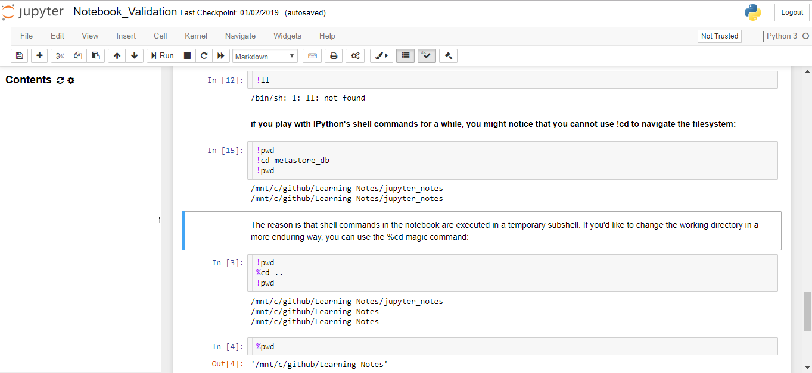
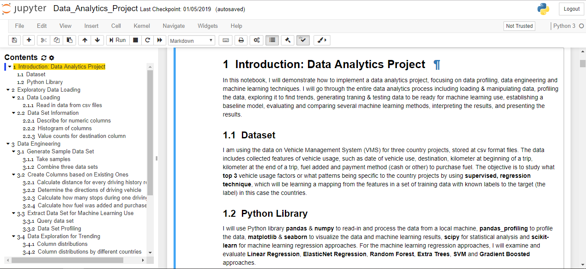

Some interesting data science projects I have done were listed in this repo for imformation sharing and knowledge transfering purposes.

# Data Science (Machine Learning) Project
* [Linux for Data Scienctists](./Linux_Data_Science) A jupyter notebook to demo some useful Linux commands to help daily work and project management.
* [Data Regression Learning - Traditional Approach](./Tradition_Data_Analytics/) A traditional solution with Python libraries, such as pandas, numpy, scikit-learn, etc. to do regression learning.
* [Data Regression Learning - Spark Implementation](./Tradition_Data_Analysis_Spark) A distributed solution with Spark and Pyspark libraries to do regression learning. 
* [Time Series Analytics - Traditional Approach](./Time_Series_Forecasting) A traditional solution with Python and Facebook Prophet libraries to do time series forecasting.
* [Natural Language Processing (NLP) Comparison - Spark Implementaion](./NLP_Analysis_Spark/) A comparison study on NLP solutions with Spark implementation.
* [Natural Language Processing (NLP) - Neural Network Approach with Sciki-learn & Gensim](./NLP_Analysis_NNC) A solution to do NLP classification with Pandas, Sciki-learn and Gensim. 
* [Natural Lanauage Processing (NLP) - Neural Network Approach with Tensflow (Coming soon...)](./NLP_Analysis_Tensorflow) A solution to do NLP classification with Tensorflow and Kares. 

# Recommended Environmental Setup
In order to implement and test the solutions, the [Environmental Setup](./Environment_Setup.md) includes:
* Prerequisite Installation & Configuration On Linux, Python, Spark and so on.
* Installation & Configuration of Jupyter Notebook

The step-by-step instructions can be found at this [link](./Environment_Setup.md) After the environment setup is finished, the validation jupyter notebook should look like as the following screen shot:

A screen shot for the jupyter notebook should looks like as following: 
